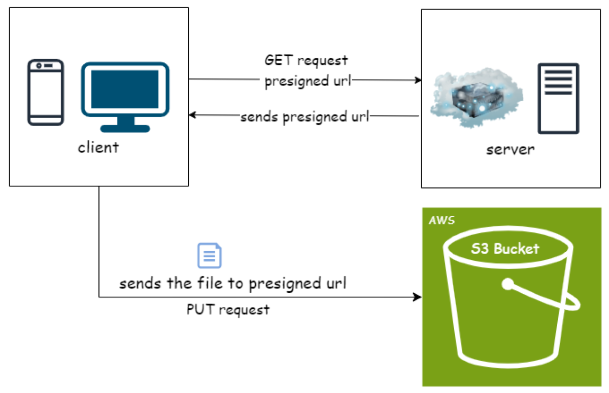
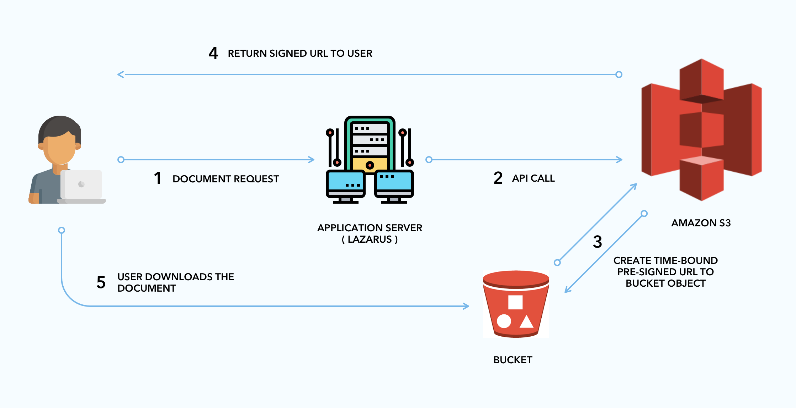
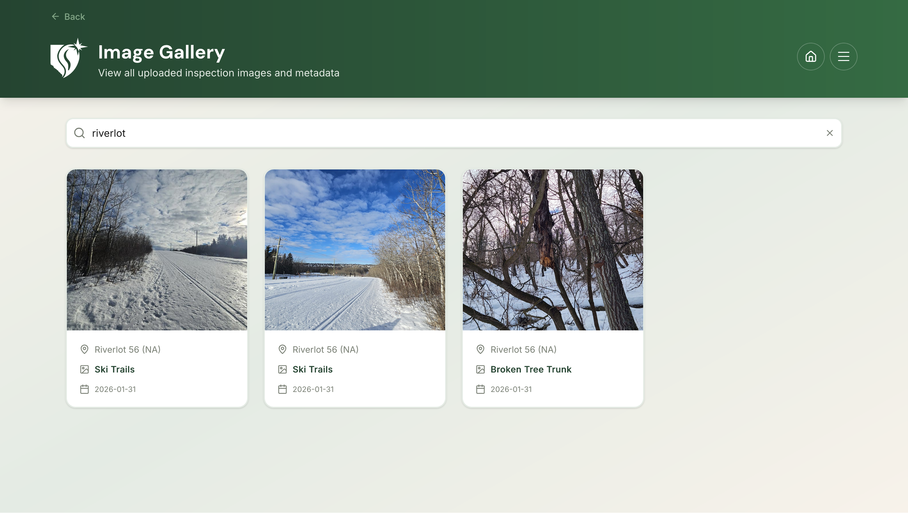
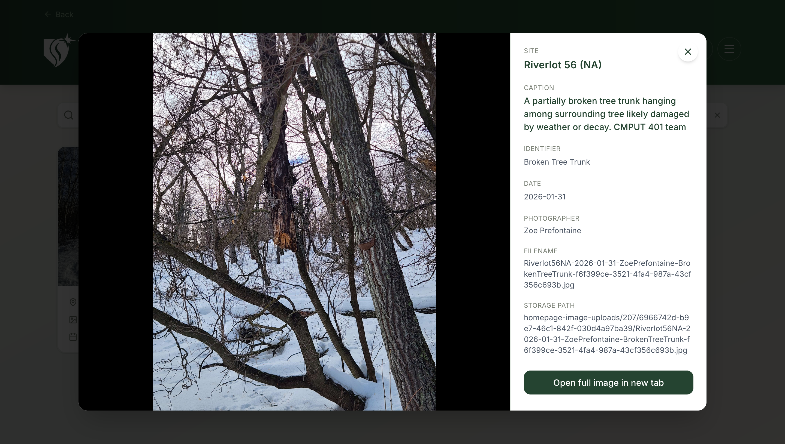
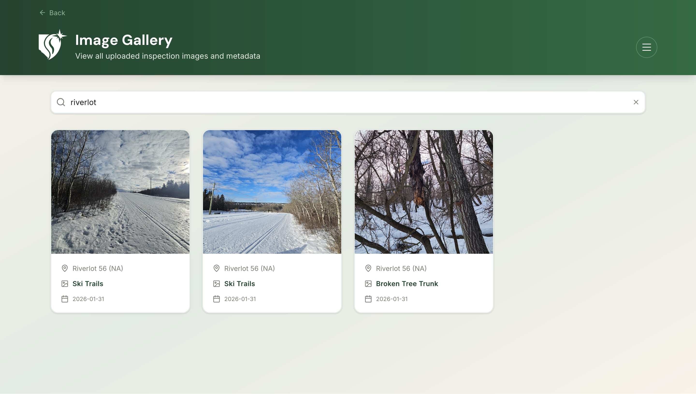
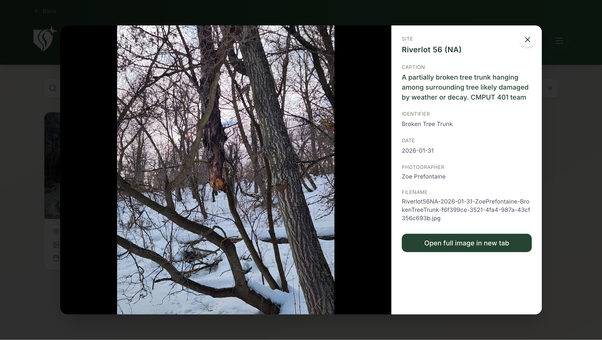

# Media Storage Architecture

This document describes how images are uploaded, stored, and retrieved in the SAPAA SIR system.  
The goal is to help future development teams understand how media files flow through the system and how AWS S3 is used.

---

## Overview

Images uploaded through the SAPAA application are stored in **AWS S3**, while their metadata is stored in the **Supabase PostgreSQL database**.

The system uses **presigned URLs** so that users upload files directly to S3 instead of routing large files through the application server.

This approach improves:

- performance
- scalability
- security

---

## High-Level Architecture

### Image Upload Architecture


---

### Image Download Architecture



---

## Image Upload Flow

### Step 1 – User selects an image

A user uploads an image through:

- a **Site Inspection Report (SIR)** image upload flow, or
- the **Standalone Homepage Image Upload** flow

The user may enter metadata such as:

- caption
- identifier
- photographer
- date
- site name 

---

### Step 2 – Client requests a presigned upload URL

The frontend uses different endpoints depending on the upload source:

#### For SIR image uploads
`````POST /api/s3/presign```

Request data includes:

- filename
- contentType
- fileSize
- siteId
- responseId
- questionId
- siteName
- date
- identifier
- photographer

#### For standalone homepage image uploads
````POST /api/s3/presign-homepage-images```

Request data includes:

- contentType
- fileSize
- siteId
- siteName
- date
- photographer
- identifier

Both APIs validate:

- user authentication
- file size
- allowed file types
- required metadata


---

## S3 Storage Structure

**Images are stored in the S3 bucket:** sapaa-inspection-images

S3 object keys differ by upload source.

### SIR upload path
`inspections/{siteId}/{responseId}/{questionId}/{generatedFilename}`

Example:
`inspections/207/3235/27/Riverlot56NA-2026-01-31-RaiyanaRahman-SkiTrails-aa05346a.jpg`

### Standalone homepage upload path
`homepage-image-uploads/{siteId}/{userId}/{generatedFilename}`

Example:
`homepage-image-uploads/207/6966742d-b9e7-46c1-842f-030d4a97ba39/Riverlot56NA-2026-01-31-ZoePrefontaine-BrokenTreeTrunk-f6f399ce-3521-4fa4-987a-43cf356c693b.jpg`

### Why a generated unique suffix is added

The generated filename includes a unique suffix so that even if two images share the same metadata, file collisions are avoided.

This ensures files are **not overwritten** while still preserving human-readable metadata in the filename.

---

## Database Metadata Storage

### SIR image metadata table
Image metadata for SIR uploads is stored in `W26_attachments`.

| Field | Description |
|-----|-----|
| id | Attachment ID |
| site_id | Associated site |
| response_id | Associated SIR response |
| question_id | Question the image belongs to |
| filename | SAPAA formatted filename |
| storage_key | S3 object key |
| caption | Image caption |
| identifier | Image identifier |
| file_size_bytes | File size |
| content_type | MIME type |

### Standalone homepage image metadata table
Image metadata for standalone homepage uploads is stored in `W26_homepage-image-uploads`.

| Field | Description |
|-----|-----|
| id | Homepage image record ID |
| site_id | Associated site |
| user_id | Uploading user |
| date | Image date |
| photographer | Photographer name |
| identifier | Image identifier |
| caption | Image caption |
| filename | SAPAA formatted filename |
| storage_key | S3 object key |
| file_size_bytes | File size |
| content_type | MIME type |

---

## Gallery API Endpoints

This section documents the API endpoints used to retrieve uploaded images and their metadata.

Images are stored in AWS S3 while metadata is stored in the Supabase PostgreSQL database.  
These endpoints generate **temporary signed URLs** so that images can be securely accessed by authenticated users.

---

## API Access Control

Some API endpoints in the SAPAA system are restricted based on user roles.  
In particular, the **gallery administration endpoint** is only accessible to users with the **admin role**.

---

## Admin-only Endpoints

### `GET /api/gallery`

This endpoint returns all uploaded SIR image attachments across all sites along with their associated metadata and signed image URLs.

Because this endpoint exposes all media files and metadata in the system, it is protected with a **server-side authorization check**.

#### Access Level

Only users whose role is set to `admin` in their authentication metadata are allowed to access this endpoint.

#### Authorization Logic

When a request is received, the server:

1. Retrieves the currently authenticated user using Supabase authentication.
2. Reads the user's role from their authentication metadata.
3. Verifies that the role is `admin`.
4. Returns a **403 Forbidden** response if the user is not an administrator.

#### Response

Returns a JSON object containing a list of images and their metadata.

Example response:
```json
{
  "items": [
    {
      "id": 14,
      "response_id": 3235,
      "question_id": 27,
      "caption": "Cross Country skil trails",
      "identifier": "Ski Trails",
      "date": "2026-01-31",
      "filename": "Riverlot56NA-2026-01-31-RaiyanaRahman-SkiTrails-aa05346a.jpg",
      "content_type": "image/jpeg",
      "file_size_bytes": 506701,
      "storage_key": "inspections/207/3235/27/Riverlot56NA-2026-01-31-RaiyanaRahman-SkiTrails-aa05346a.jpg",
      "site_id": 207,
      "site_name": "Riverlot 56 (NA)",
      "imageUrl": "https://sapaa-inspection-images.s3.ca-central-1.amazonaws.com/..."
    }
  ]
}
```

---

### `GET /api/homepage-images`

Returns all standalone homepage image uploads with metadata and signed image URLs.

#### Access Level

Admin users only.

#### Response Format
```json
{
  "items": [
    {
      "id": 16,
      "site_id": 207,
      "site_name": "Riverlot 56 (NA)",
      "date": "2026-01-31",
      "photographer": "Raiyana Rahman",
      "caption": "Cross Country skil trails",
      "identifier": "Ski Trails",
      "filename": "Riverlot56NA-2026-01-31-RaiyanaRahman-SkiTrails-0642088a-b29f-400a-9ce7-e1003fa1e928.jpg",
      "file_size_bytes": 506701,
      "storage_key": "homepage-image-uploads/207/user-id/Riverlot56NA-2026-01-31-RaiyanaRahman-SkiTrails-0642088a-b29f-400a-9ce7-e1003fa1e928.jpg",
      "imageUrl": "https://sapaa-inspection-images.s3.ca-central-1.amazonaws.com/..."
    }
  ]
}
```

---

### `GET /api/homepage-images/{siteId}`

Returns standalone homepage image uploads for a specific site.

#### Access Level

Admin users only.

#### Path Parameters

| Parameter | Type    | Required | Description |
|-----------|---------|----------|-------------|
| `siteId`  | integer | Yes      | Site ID |

#### Response

```json
{
  "items": [
    {
      "id": 16,
      "site_id": 207,
      "site_name": "Riverlot 56 (NA)",
      "date": "2026-01-31",
      "photographer": "Raiyana Rahman",
      "caption": "Cross Country skil trails",
      "identifier": "Ski Trails",
      "filename": "Riverlot56NA-2026-01-31-RaiyanaRahman-SkiTrails-0642088a-b29f-400a-9ce7-e1003fa1e928.jpg",
      "file_size_bytes": 506701,
      "storage_key": "homepage-image-uploads/207/user-id/Riverlot56NA-2026-01-31-RaiyanaRahman-SkiTrails-0642088a-b29f-400a-9ce7-e1003fa1e928.jpg",
      "imageUrl": "https://sapaa-inspection-images.s3.ca-central-1.amazonaws.com/..."
    },
    {
      "id": 21,
      "site_id": 207,
      "site_name": "Riverlot 56 (NA)",
      "date": "2026-01-31",
      "photographer": "Zoe Prefontaine",
      "caption": "A partially broken tree trunk hanging among surrounding tree likely damaged by weather or decay. CMPUT 401 team",
      "identifier": "Broken Tree Trunk",
      "filename": "Riverlot56NA-2026-01-31-ZoePrefontaine-BrokenTreeTrunk-f6f399ce-3521-4fa4-987a-43cf356c693b.jpg",
      "file_size_bytes": 1852012,
      "storage_key": "homepage-image-uploads/207/user-id/Riverlot56NA-2026-01-31-ZoePrefontaine-BrokenTreeTrunk-f6f399ce-3521-4fa4-987a-43cf356c693b.jpg",
      "imageUrl": "https://sapaa-inspection-images.s3.ca-central-1.amazonaws.com/..."
    }
  ]
}
```

---

## Authentication based endpoint

### `GET /api/sites/{siteId}/gallery`

Returns SIR image attachments associated with a specific site.

This endpoint allows authenticated users to retrieve media files linked to a site inspection or site record.

#### Access Level

Authenticated users only.

Unlike `/api/gallery`, which is restricted to administrators, this endpoint allows normal users to view images associated with sites they have access to.

#### Response

Returns a JSON object containing a list of images and their metadata.

Example response:
```json
{
  "items": [
    {
      "id": 14,
      "caption": "Cross Country skil trails",
      "identifier": "Ski Trails",
      "filename": "Riverlot56NA-2026-01-31-RaiyanaRahman-SkiTrails-aa05346a.jpg",
      "file_size_bytes": 506701,
      "site_name": "Riverlot 56 (NA)",
      "response_id": 3235,
      "imageUrl": "https://sapaa-inspection-images.s3.ca-central-1.amazonaws.com/..."
    }
  ]
}
```

---

### `GET /api/site-images`

Returns image attachments associated with a site or inspection response.

Images are stored in AWS S3 while metadata is stored in the Supabase database.  
This endpoint generates temporary **signed URLs** that allow images to be securely viewed.

#### Access Level

Authenticated users only.

The server verifies that the requester is logged in before returning any image metadata.

#### Query Parameters

| Parameter | Type | Required | Description |
|-----------|------|----------|-------------|
| `siteid` | integer | No | Filters images belonging to a specific site |
| `responseid` | integer | No | Filters images belonging to a specific inspection response |

At least **one** parameter must be provided.

#### Example Requests

**Retrieve images for a site:** ```/api/site-images?siteid=207```

**Retrieve images for an inspection response:** ```/api/site-images?responseid=3235```

**Retrieve images filtered by both:** ```/api/site-images?siteid=207&responseid=3235```

#### Response Format

Returns a JSON object containing an array of images.

Example:
```json
{
  "items": [
    {
      "id": 14,
      "response_id": 3235,
      "question_id": 27,
      "filename": "Riverlot56NA-2026-01-31-RaiyanaRahman-SkiTrails-aa05346a.jpg",
      "storage_key": "inspections/207/3235/27/Riverlot56NA-2026-01-31-RaiyanaRahman-SkiTrails-aa05346a.jpg",
      "content_type": "image/jpeg",
      "file_size_bytes": 506701,
      "caption": "Cross Country skil trails",
      "identifier": "Ski Trails",
      "site_id": 207,
      "imageUrl": "https://sapaa-inspection-images.s3.ca-central-1.amazonaws.com/..."
    }
  ]
}
```

---

### `GET /api/user-gallery/homepage-upload`

Returns all standalone homepage image uploads with metadata and signed S3 URLs, ordered by date descending.

#### Access Level

Authenticated users only.

Unlike `/api/homepage-images`, which is restricted to administrators, this endpoint allows all authenticated users to retrieve homepage image uploads.

#### Response

Returns a JSON object containing a list of images and their metadata.

Example response:
```json
{
  "items": [
    {
      "id": 16,
      "site_id": 207,
      "site_name": "Riverlot 56 (NA)",
      "date": "2026-01-31",
      "photographer": "Raiyana Rahman",
      "caption": "Cross Country ski trails",
      "identifier": "Ski Trails",
      "filename": "Riverlot56NA-2026-01-31-RaiyanaRahman-SkiTrails-0642088a-b29f-400a-9ce7-e1003fa1e928.jpg",
      "file_size_bytes": 506701,
      "imageUrl": "https://sapaa-inspection-images.s3.ca-central-1.amazonaws.com/..."
    }
  ]
}
```

---

### `GET /api/user-gallery/sir-upload`

Returns all SIR inspection image attachments (JPEG, PNG, WebP) across all sites with resolved site names and signed S3 URLs, ordered by ID descending.

#### Access Level

Authenticated users only.

Unlike `/api/gallery`, which is restricted to administrators, this endpoint allows all authenticated users to retrieve SIR inspection images across all sites.

#### Response

Returns a JSON object containing a list of images and their metadata.

Example response:
```json
{
  "items": [
    {
      "id": 14,
      "response_id": 3226,
      "question_id": 27,
      "caption": "Cross Country ski trails",
      "identifier": "Ski Trails",
      "date": "2026-01-31",
      "content_type": "image/jpeg",
      "file_size_bytes": 506701,
      "filename": "Riverlot56NA-2026-01-31-RaiyanaRahman-SkiTrails-aa05346a.jpg",
      "site_id": 207,
      "site_name": "Riverlot 56 (NA)",
      "imageUrl": "https://sapaa-inspection-images.s3.ca-central-1.amazonaws.com/..."
    }
  ]
}
```

---

## Security Model

The system protects images using several mechanisms:

### Authentication

Only authenticated users can:

- upload images
- request presigned URLs

---

### Private S3 bucket

The S3 bucket is **not publicly accessible**.

Images are accessed through **temporary signed URLs**. This endpoint generates temporary signed URLs for each image using AWS S3.
These URLs expire after 1 hour, preventing public access to stored images.

---

### Signed URLs

Two types of signed URLs are used:

| Type | Purpose |
|-----|-----|
| Upload URL | Allows client to upload file to S3 |
| Download URL | Allows temporary viewing of image |

Signed URLs expire after a short time.

---

## Why Direct S3 Uploads Are Used

Uploading files directly to S3 provides several benefits:

### Performance

Large files do not pass through the application server.

### Scalability

The backend does not become a bottleneck when many users upload images.

### Security

The server validates requests before issuing upload permissions.

---

## Admin Gallery

Admins can view all uploaded images through the gallery interface.

Features include:

- viewing SIR inspection images across all sites
- viewing standalone homepage-uploaded images
- viewing metadata such as storage path,captions, identifiers, filenames, and dates 
- images are displayed using signed S3 URLs generated by the server



---

## User Gallery

Authenticated users can view uploaded images through the user gallery interface.

Features include:

- viewing SIR inspection images across all sites
- viewing standalone homepage-uploaded images
- viewing metadata such as captions, identifiers, filenames, and dates
- images are displayed using signed S3 URLs generated by the server

Unlike the Admin Gallery, the user gallery does not expose storage paths beyond what is embedded in the filename.




---

## Related API Endpoints

| Endpoint | Purpose |
|-----|-----|
| `/api/s3/presign` | Generate S3 upload URL for SIR image uploads |
| `/api/s3/presign-homepage-images` | Generate S3 upload URL for standalone homepage image uploads |
| `/api/gallery` | Retrieve all SIR uploaded images |
| `/api/site-images` | Retrieve SIR images for a site and/or inspection response |
| `/api/sites/{siteId}/gallery` | Retrieve SIR images for a specific site |
| `/api/homepage-images` | Retrieve all standalone homepage images |
| `/api/homepage-images/{siteId}` | Retrieve standalone homepage images for a specific site |
| `/api/user-gallery/homepage-upload` | Retrieve all standalone homepage images |
| `/api/user-gallery/sir-upload` | Retrieve all SIR inspection images |

---

## Summary

The SAPAA SIR system stores images in AWS S3 while maintaining metadata in Supabase.

Key features of the architecture include:

- direct client uploads using presigned URLs
- structured storage paths
- standardized file naming
- secure private storage
- scalable image retrieval

This architecture allows SAPAA to efficiently store and organize large numbers of inspection images while maintaining strong security and performance
````