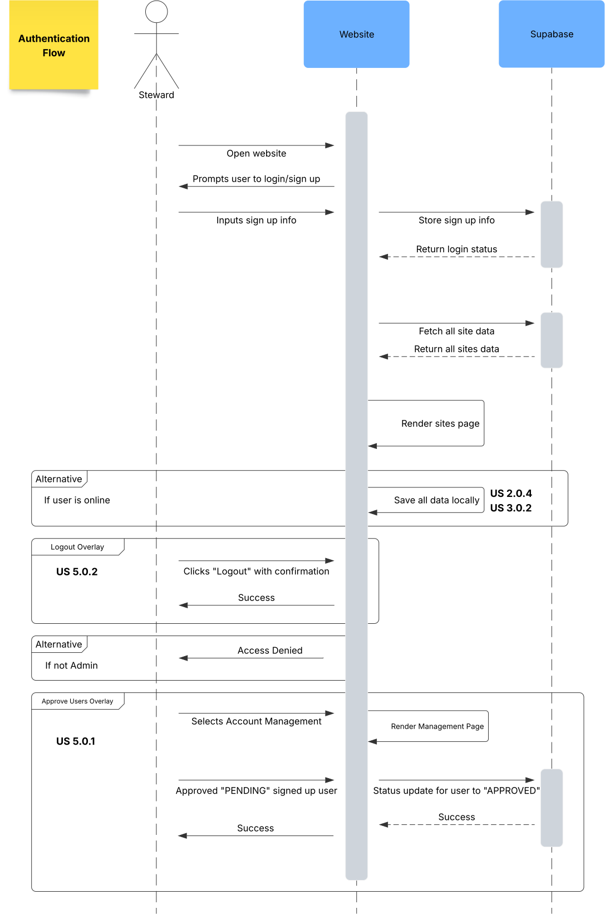
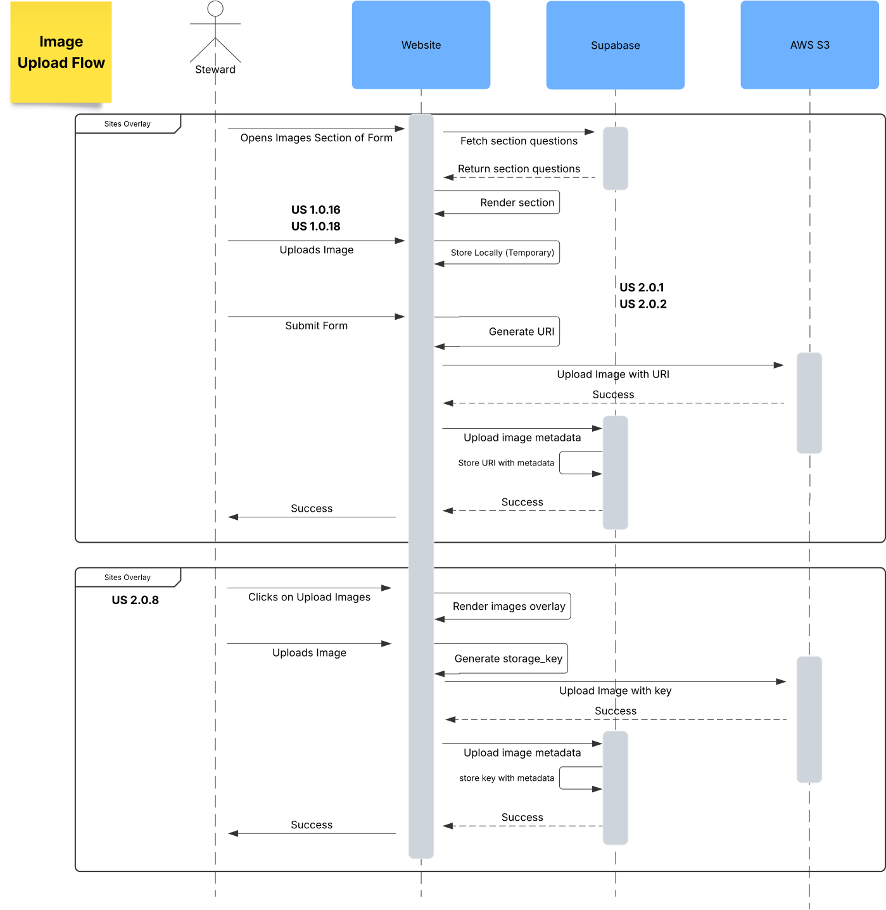
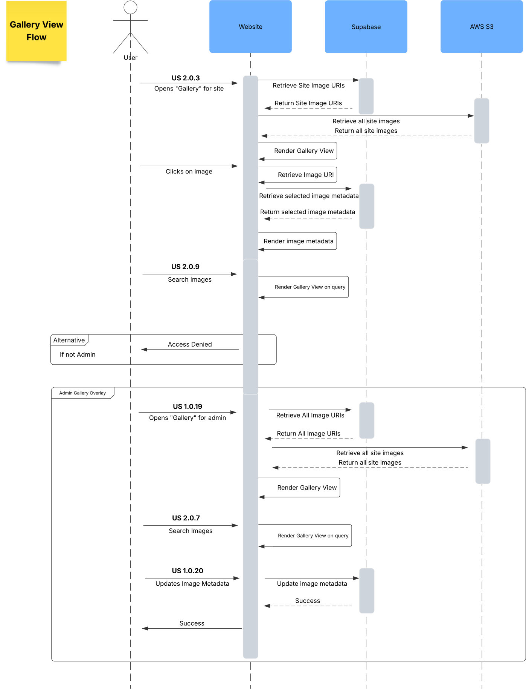
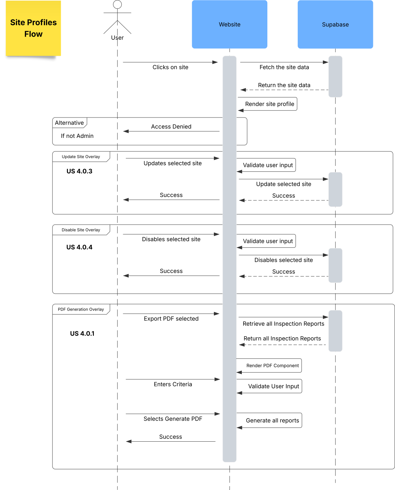

# Software Design

This page includes a short description of the overall architecture style of the system, its high-level system components, and their logical (what data they exchange) and control (how they invoke each other) dependencies.

## Architecture Diagram

This diagram provides a high-level understanding of the architecture involved in the project.

## ER Diagram for the database schema

## UML Class Diagram

This diagram is a description of logical entities of the domain through a UML diagram.

[View it on mermaid](https://mermaid.ai/live/edit#pako:eNrlWG1v2zYQ_iuCgALe6ni2k8aOEARw6xYw0CZpjCJA532gxbPNVSI1ispLs_z3HWVJJmlJ9r5u_mDI5HPHu4fH5yi_-KGg4Ad-GJE0nTKyliRecC__vHnjfXxSIDmJvPlzqiBOy6kc7t3DcpIk3ks5qj-Xl1DYXF2Z49c43PuzcvC64LavL2LJIjja3R2QUHnXRLEH-O3jUyIaHc-zhCxJCu9J-AM4Pex-z8NnEZJo_vUzU_CvrJG_OcgHFoLD2yRTm2LGdvg2EmvGOxATFgVeqiTj666XoM2jkLQc-cULvKUQERC-b3zP1OZGL9BJpHhgFOQRZiJTHT39IBi15tagPmRSAlffUpA5Rj80UjWLyRrqU8uSSBCaAzor3OrA-4TfXY_xNIFQMcFnmCHP4iVIvU6OdIPJB9NOq83vv_5hmVGIQMF2Yaa_ZweZxJXmbM2BfpNRnc32qZGFCY0Zr2cBPU-iSHOYVmy6ARNKc7adMpBCk9Ye-DbX3DrDr9ZM98KeEpWflMbI53gCtmHrJzdsvT3VvkxBYfBpJ0XgNYmtwHcop0AowX2qJo1dNm3aUzfNrdI4lPzNahUx3pA7FY9cV69OuzaluoMzLYyA7ngrVnmfcRrtERjqALME1YxJ02jPOUtvuHbTOSax2-mnpg3lIJHxO0iEVC1sbwG3dGWZpxsiS1t9nm-J2jRRYovijKNorkgIjlArIfGk3Ray5UotK63sRlDoiiUpiROKfVytHe24WO2hpq72cA2yoQWjfXmnQWyTRuVKIohRZ4lm3e0X9_MSZ5FyssywpymzGP8r1Ni9-_-WPRbGF7yXRU4daF13DjGjtVlYrcOaMbtIM-97V523OzW1hnkT-6HIuHo-uNJOaY5bT4vvrH6qEDDsYhiRbiVOoCqTJOKQpvNQSKjPRqDm1qaDt99HIunhfOK9Om3ao7pLjLPmVhCNqrHmdWXz9uoHOlE2GU2Nb9uSnMjdVld7UhoIR-dqEuLdNwVaM83Sos8d1cSqFnRclbQyU_a9msDtI3gH0VaNNyypTmLxznNycmVd4wMP71t1IOtG3IiyboyNKPeCVgJL6O4dqj08G9cSoQ1sWr4O61yn3EitNTXebf62b3f28u9ez-yKgcfK_tlu4zYU27A0NZnTweW6G3gx4frtownlvmgGHkFEhTZ3uB7-VwaS7fy7dDesof16YlegDvP1VukzD42Ea2zMl9691M1JY7cLDdGnDhW2LSLXQAKqM29NvdGk2nAnyzzz2vBtVwYuJOHGqLoyPaNJBd6GVABjvDpI2ovAaxzbZWPcwPe8lWLU5HMnfAbW7_pryagfKJlB149BYrvHn34ujgtfbbCiF36Aj5TIHwt_wV_RJiH8uxBxaSZFtt74wYpEKf7avn0V_wBVEOQR5Afdyv3gXe7BD178J_wx6o1Ox6fj8WjQH74bXvTPu_6zH5ycDnujwXA4OL0YjAZng9H5a9f_mS866A3GF2dnw_HotN8f9C_G56__ALB1ocA)

## Sequence Diagrams

[View them on Lucidchart](https://lucid.app/lucidchart/97b40fe8-0ea1-4e2c-9118-472d71b630ff/edit?invitationId=inv_d023aae0-265e-478f-a9a1-b356599b6444&page=0_0#)

### Authentication

### Site Inspection Form

### Update Form

### Image Upload

### Gallery View

### Site Profiles

### Account Management

## Low-Fidelity User Interface

This is a low-fidelity projection of the end-product. The final design may take a different direction.

[View them on figma](https://www.figma.com/design/8WLN54CokqHyoJHdGFY6kd/SAPAA-UI?node-id=0-1&p=f&t=dd9Or2IMUNQLwult-0)

### This is a low-fidelity UI for the web app

### This is a low-fidelity UI for the mobile app

## List of Technologies Used
### Backend: Supabase + PostgreSQL + AWS
  * [Supabase Documentation](https://supabase.com/docs)  
  * [PostgreSQL Documentation](https://www.postgresql.org/docs/) 
  * [Amazon S3](https://docs.aws.amazon.com/AmazonS3/latest/userguide/Welcome.html) 

### Cloud Infrastructure & Cost Control
  * [AWS IAM](https://docs.aws.amazon.com/iam/)
  * [AWS Budgets & Billing Alerts](https://docs.aws.amazon.com/cost-management/)

### Deployment: Cybera
  * [Cybera Documentation](https://wiki.cybera.ca/spaces/RAC/pages/8880558/Rapid+Access+Cloud)

### Mobile: React Native
  * [React Native Documentation](https://reactnative.dev/docs/getting-started)
  * [PDF.js Documentation](https://mozilla.github.io/pdf.js/)  

### Testing & Tools
  * [Jest Testing Framework](https://jestjs.io/)
  * [Postman](https://www.postman.com/) for API testing  