# SAPAA
## Protected Areas Inspection App
### UI / UX Design Documentation - v3.0
#### Design System Reference for Development Teams
`Next.js` · `Tailwind CSS` · `Supabase` · `AWS`

---

## 1. Introduction

### 1.1 Purpose

This document defines the complete UI/UX design system for the SAPAA (Stewards of Alberta's Protected Areas Association) web application. It covers design principles, usability heuristics, accessibility considerations, responsive design patterns, and component-level implementation guidance for the web (Next.js) platform.

Consistency is critical. Every page must follow the patterns described here so that users experience a coherent interface across all screens and workflows.

### 1.2 Technology Stack

| Area | Technology |
|---|---|
| Framework | Next.js (App Router, TypeScript) |
| Styling | Tailwind CSS - utility-first, inline class names only |
| Database | Supabase (PostgreSQL) - tables prefixed `W26_` |
| Auth | Supabase Auth with `ProtectedRoute` wrapper |
| Drag and Drop | `@dnd-kit/core` + `@dnd-kit/sortable` |
| Maps | Leaflet (SSR-guarded with mounted state) |
| Charts | Chart.js via `react-chartjs-2` |
| Icons | `lucide-react` (primary), `@mui/icons-material`, `react-icons` |
| UI Components | `@mui/material` v7 (selective use alongside Tailwind) |
| Guided Tours | `react-joyride` (in-app tutorials) |

### 1.3 Application Pages

| Route | Component |
|---|---|
| `/sites` | HomeClient - public site listing |
| `/detail/[namesite]` | SiteDetailScreen - single site view |
| `/detail/[namesite]/new-report` | New inspection report form |
| `/detail/[namesite]/edit-report/[responseId]` | Edit existing report |
| `/gallery` | Image gallery with search and filtering |
| `/login` `/signup` | Authentication pages |
| `/terms` | Terms of service page |
| `/admin/dashboard` | Admin analytics and stats |
| `/admin/account-management` | User account administration |
| `/admin/sites` | Site management |
| `/admin/gallery` | Inspection photo gallery |
| `/admin/form-editor` | Form section and question editor |

---

## 2. Design Principles

### 2.1 Visual Consistency

Maintain a consistent visual language to reduce cognitive load and build user confidence.

**Unified navigation shell:**
Consistent header with SAPAA logo, gradient green background, and navigation elements. Admin pages use a hamburger menu for navigation.

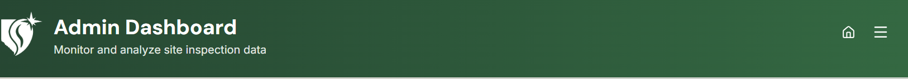 

**Standardised colour palette:** Primary green (`#254431`, `#356B43`) for headers and primary actions. White (`#FFFFFF`) for content cards. Light grey (`#F7F2EA`, `#E4EBE4`) for dividers and secondary surfaces. Red (`#B91C1C`) for destructive actions.

**Typography hierarchy:** Page titles at large and bold (24–32px). Section headers at medium and semi-bold (18–20px). Body text at regular weight (14–16px). Supporting text at smaller regular (12–14px).

### 2.2 Clear Visual Hierarchy

Guide attention using size, weight, colour, and spacing.

**Card-based layout:** Major information chunks are grouped into cards (e.g., Site Details, Naturalness Details, Analytics charts, Account tiles). Cards use consistent padding, rounded corners, and subtle shadows.

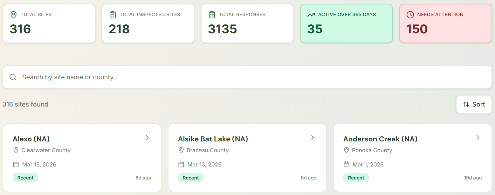 


**Strategic emphasis:** Primary actions use filled green buttons with high visual weight (e.g., Preview PDF, Sync Now, Login). Secondary actions use outlined buttons or lower-contrast styling.

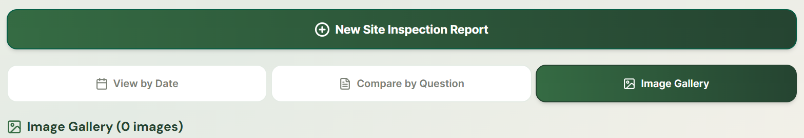


**Consistent spacing:** Padding inside cards (16–24px) and consistent vertical spacing between sections (16–32px) creates rhythm and improves readability.

### 2.3 Progressive Disclosure

Show only what users need at each step, and reveal more detail on demand.

**Inspection Reports:** Tabs for By Date and By Question instead of one long view. Expandable sections for detailed observations.

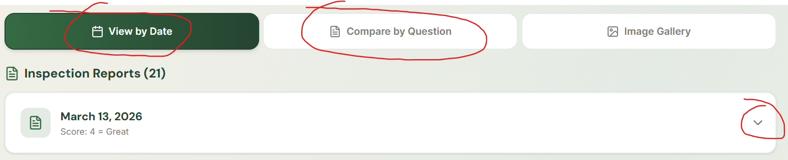 

**Site Details:** High-level information at the top (name, location, key metrics). Detailed observations and naturalness details appear further down in separate cards.

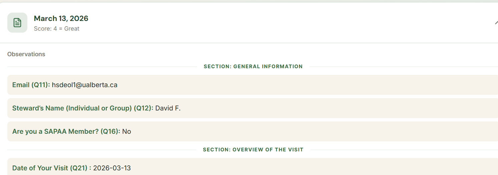 

**Admin Features:** Admin-specific features are not visible to regular users. Admin navigation is accessible via menu or dedicated button.

### 2.4 Action-Oriented Design

Make key tasks obvious and easy to complete.

**Button hierarchy:** Primary uses solid green, often full width. Secondary uses outlined or low-emphasis styling. Destructive uses red with a clear label.

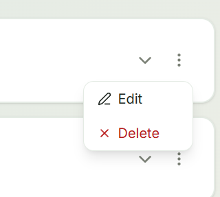 


**Immediate feedback:** Counters and indicators update live as users interact. Loading states show progress indicators. Lists and cards visually respond to user interaction.

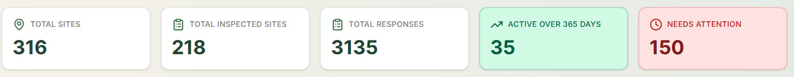 

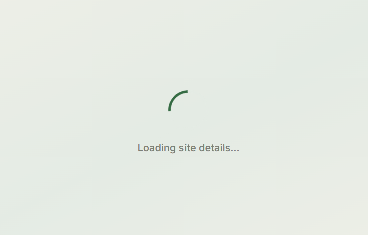 

---

## 3. Usability Heuristics (Nielsen's 10)

### 3.1 Visibility of System Status

The system always keeps users informed about what is going on.

**Web:** Loading spinners appear during data fetches. Page titles reflect the current location. Active navigation items are highlighted. Search results show a count of sites found.

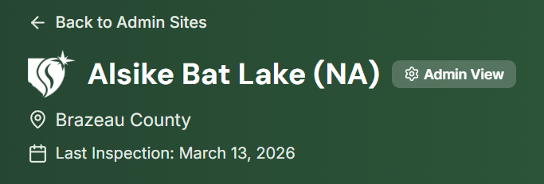 

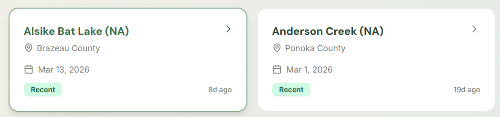 

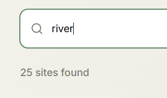 


**Why this matters:** Users can see that their actions are working and understand where they are in the app, reducing confusion and frustration.

### 3.2 Match Between System and the Real World

The application uses terminology that stewards already know: Naturalness Score, Recreational Activities, Observations. The SAPAA Map uses Google Maps (mobile) and Leaflet (web) with familiar map interactions. Inspection questions are labelled with codes (Q52, Q62, etc.) that match existing steward workflows.

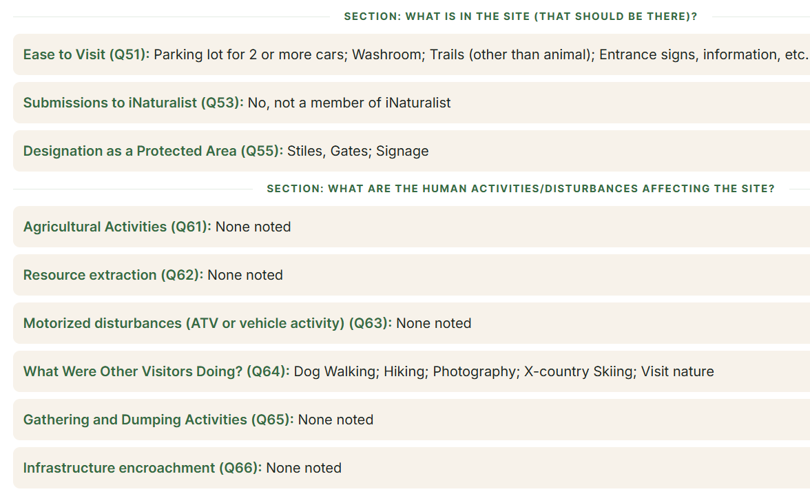 

**Why this matters:** Familiar language and visuals reduce training time and make the app feel like a natural extension of existing workflows.

### 3.3 User Control and Freedom

Provide clearly marked exits and ways to undo actions.

**Web:** Back buttons appear on all detail pages. Modal dialogs can be closed with the X button or by clicking outside. Cancel buttons appear on forms. Breadcrumb navigation is used where applicable.

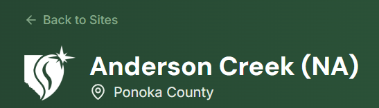 

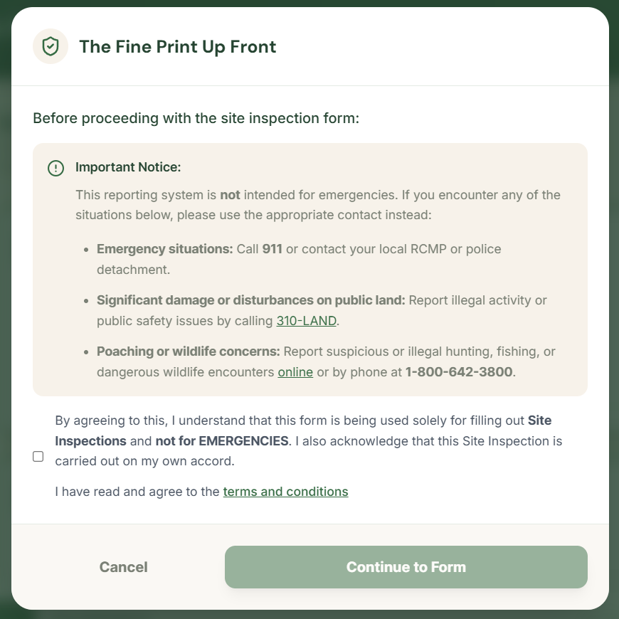 


**Why this matters:** Users feel safe exploring features because they know they can easily back out or adjust their choices.

### 3.4 Consistency and Standards

Follow platform conventions and maintain internal consistency.

**Web:** Consistent header design across all pages. Button styles are standardized (primary, secondary, destructive). Form inputs follow the same styling. Card components are reused throughout.

**Why this matters:** Once users learn basic patterns, they can apply them everywhere in the app.

### 3.5 Error Prevention

Design to prevent errors before they happen.

**Web:** Form validation prevents invalid submissions. Confirmation dialogues guard against destructive actions. Disabled states prevent invalid interactions. Clear error messages guide users to a resolution.

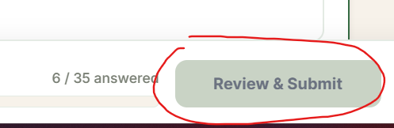 

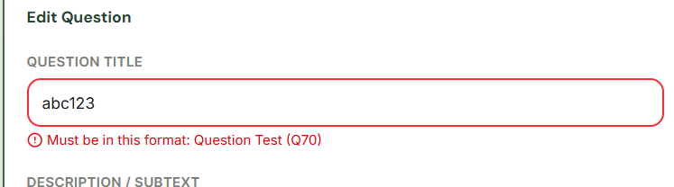 

**Why this matters:** Preventing mistakes saves time and protects data integrity.

### 3.6 Recognition Rather Than Recall

All fields are clearly labelled: Region, Area (HA/AC), Naturalness Details, and so on. Status badges show inspection recency with colour coding, so users do not need to calculate dates themselves.

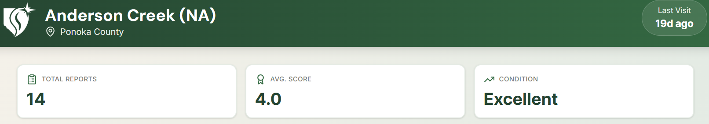 


**Why this matters:** Users do not have to remember information across screens; they can recognise it instead.

### 3.7 Flexibility and Efficiency of Use

Provide accelerators for expert users while keeping the interface simple for novices.

**Multiple access paths:** Inspection reports can be viewed By Date (chronological workflow) or By Question (comparison/analysis workflow).

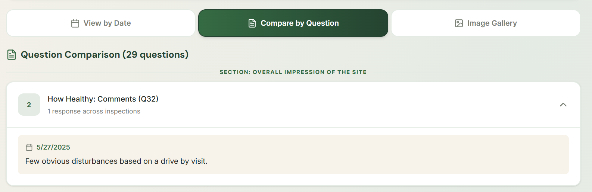 

**Smart defaults:** PDF generation starts with all fields selected, so users typically only need to deselect a few. Search is always available. Sort options are remembered.

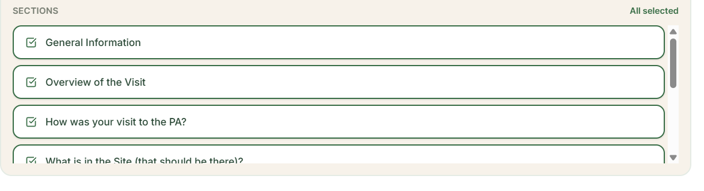 

**Why this matters:** New users can follow straightforward flows, while experienced users can speed up their work with bulk actions and shortcuts.

### 3.8 Aesthetic and Minimalist Design

Interfaces should not contain irrelevant or rarely needed information.

Each screen is focused on one main task: view analytics, inspect a site, manage accounts, or generate a PDF. A limited colour palette (green, white, grey, and red for warnings) keeps the interface clean. Cards group only related information with enough white space for breathing room.

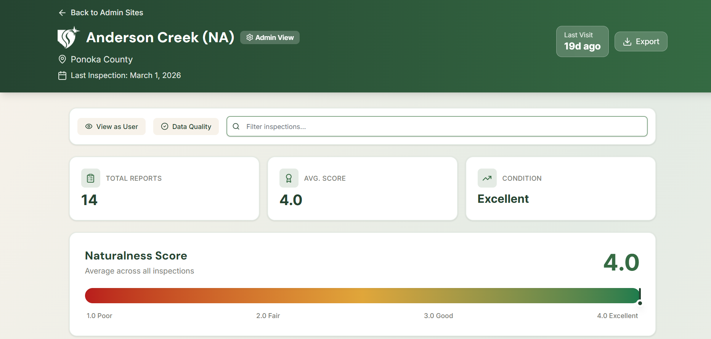 

**Why this matters:** A clean interface makes it easier to focus on what matters and reduces cognitive overload.

### 3.9 Help Users Recognise, Diagnose, and Recover from Errors

Error messages should be expressed in plain language, indicate the problem, and suggest a solution.

**Web:** Error messages are displayed in red with clear visibility. Form validation shows specific field errors. Network errors provide retry buttons. 404 pages guide users back to main content.

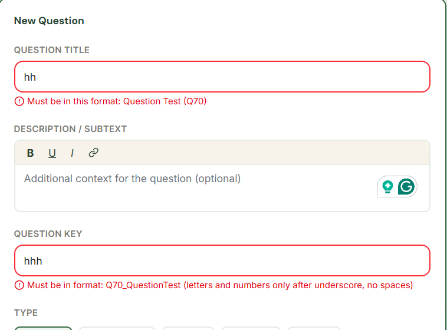 

**Why this matters:** Users can quickly understand what went wrong and how to fix it rather than feeling frustrated.

### 3.10 Help and Documentation

Help should be easy to find, focused on the user's task, and list concrete steps.

A user manual is available as an app tutorial. In-app tooltips and hints are provided where appropriate. Clear labels and placeholders guide users through forms. Status messages explain what actions do (e.g., "Syncing data..."). Page titles and descriptions provide contextual orientation throughout the web application.

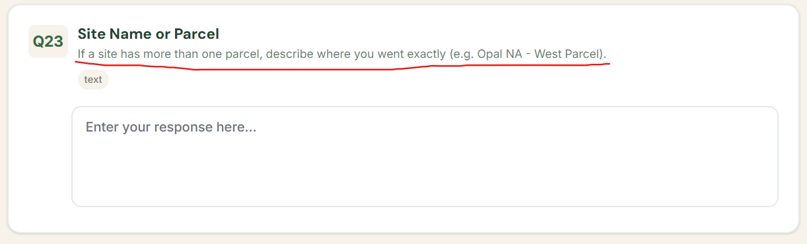 


**Why this matters:** While the interface should be self-explanatory, having documentation available helps users learn advanced features.

---

## 4. Accessibility

### 4.1 Web Application

- **Keyboard navigation:** All interactive elements are keyboard accessible.
- **Screen readers:** Semantic HTML and ARIA labels are used where needed.
- **Colour contrast:** All text meets WCAG AA standards.
- **Focus indicators:** Clear focus states are provided for keyboard navigation.
- **Responsive design:** Mobile-first approach using Tailwind breakpoints. See Section 20 for full responsive design specification.
- **Alt text:** All images include descriptive alt text.
- **Touch targets:** Interactive elements meet minimum 44x44px touch target size for mobile accessibility.

---

## 5. Colour Palette

All colours in the application are drawn from a forest-green and warm-cream palette. Custom hex values are used throughout. No Tailwind named colour shades (e.g., `green-700`) appear in the codebase.

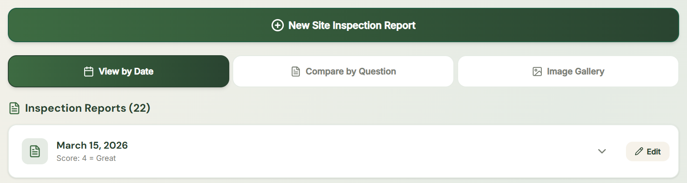 

### 5.1 Primary Brand Colours

| Token | Hex | Usage |
|---|---|---|
| Forest Dark | `#254431` | Page titles, section headings, strong text, header gradient start |
| Forest Mid | `#356B43` | Buttons, active states, icons, header gradient end, links |
| Forest Light | `#86A98A` | Hover states, muted header text, secondary borders |

### 5.2 Background Colours

| Token | Hex | Usage |
|---|---|---|
| Warm Cream | `#F7F2EA` | Page background gradient from/to, preview panels, alternating rows |
| Cool Sage | `#E4EBE4` | Page background gradient via, borders, chips, hover fills |

### 5.3 Text Colours

| Token | Hex | Usage |
|---|---|---|
| Deep Charcoal | `#1E2520` | Primary body text, high-contrast content |
| Forest Dark | `#254431` | Heading text, stat numbers, labels |
| Muted Sage | `#7A8075` | Captions, metadata, labels, placeholder text |

### 5.4 Status and Semantic Colours

| Pair | Usage |
|---|---|
| `#B91C1C` / `#FEE2E2` | Error states, required badges, destructive actions |
| `#7F1D1D` / `#FEE2E2` | Needs Review status badge (more than 730 days) |
| `#065F46` / `#D1FAE5` | Success, Recent inspection badge (fewer than 180 days) |
| `#92400E` / `#FEF3C7` | Past Year badge (181–365 days) |
| `#9A3412` / `#FFEDD5` | Over 1 Year badge (366–730 days) |
| `#475569` / `#F1F5F9` | Never Inspected badge |

### 5.5 Gradients

```
Header:     bg-gradient-to-r from-[#254431] to-[#356B43]
Background: bg-gradient-to-br from-[#F7F2EA] via-[#E4EBE4] to-[#F7F2EA]
Button:     bg-gradient-to-r from-[#356B43] to-[#254431]
```

---

## 6. Typography

Typography is primarily handled through Tailwind utility classes, with global font setup in `app/globals.css`.
The current web implementation loads Google Fonts `Inter` (body/UI) and `DM Sans` (headings), then applies them globally.

### 6.1 Type Scale

| Class | Usage |
|---|---|
| `text-3xl font-bold` | Page titles (always white inside headers) |
| `text-2xl font-bold text-[#254431]` | Section headings within page body |
| `text-xl font-bold text-[#254431]` | Sub-section headings, card titles |
| `text-base` / `text-sm text-[#7A8075]` | Body text, subtitles in headers |
| `text-sm font-semibold text-[#7A8075] uppercase tracking-wide` | Label / caption above inputs and stat cards |
| `text-3xl font-bold text-[#254431]` | Stat numbers on cards |
| `text-xs font-semibold` | Badges, chips, type indicators |
| `text-[10px] font-bold uppercase tracking-tight` | Micro-labels (Hidden badge, Live Draft pill) |

### 6.2 Key Rules

- Never use `text-4xl` or larger inside the body area. Reserve large text for the header only.
- All label text above inputs must be uppercase with `tracking-wide`.
- Stat numbers always use `text-3xl font-bold text-[#254431]` regardless of which page they appear on.
- Truncate long strings with the `truncate` class rather than wrapping.

---

## 7. Page Layout

### 7.1 Outer Page Shell

Most pages wrap their return in an outer `div` with the warm background gradient. This is the dominant pattern and should be used for new pages unless the page has a specific layout requirement.

```tsx
<ProtectedRoute requireAdmin>
  <div className="min-h-screen bg-gradient-to-br from-[#F7F2EA] via-[#E4EBE4] to-[#F7F2EA]">
    {/* Header */}
    <div className="bg-gradient-to-r from-[#254431] to-[#356B43] ...">
      ...
    </div>   {/* header closes HERE */}
    {/* Main Content */}
    <div className="max-w-7xl mx-auto px-6 py-6">
      ...
    </div>
  </div>
</ProtectedRoute>
```

### 7.2 Max Width Constraint

`max-w-7xl mx-auto` is the standard container used across most pages (header interior, main content, alerts).  
Known exceptions exist (for example Form Editor header uses `max-w-[100vw]`) and should be treated as intentional per-page overrides.

### 7.3 Main Content Padding

The main content `div` uses responsive padding: `px-4 sm:px-6 py-4 sm:py-6` on most pages. Inner sections add their own vertical spacing via `mb-6` or `space-y-6`.

### 7.4 Three-Column Admin Layout (Form Editor)

The Form Editor uses a special three-column layout inside the main content area:

- Left sidebar: `w-[220px] flex-shrink-0` - section navigation
- Centre column: `flex-1 min-w-0` - question list and editor
- Right panel: `w-[340px] flex-shrink-0 hidden lg:block` - live preview (desktop only)

The three columns are wrapped in a `flex gap-8` container inside a `DndContext` provider.

---

## 8. Header Component

The application uses a shared green-header style but not one identical markup structure on every page. Most pages use a full-width dark-green banner with logo/title/subtitle and optional right-side actions.

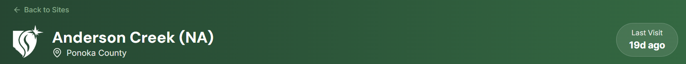 

### 8.1 Standard Header (Primary Site/Detail Pattern)

Headers use responsive padding and font sizes to adapt to different screen sizes:

```tsx
<div className="bg-gradient-to-r from-[#254431] to-[#356B43] text-white px-4 sm:px-6 py-4 shadow-lg">
  <div className="max-w-7xl mx-auto">
    {/* Optional back button */}
    <button className="flex items-center gap-1.5 text-[#86A98A] hover:text-white
                        transition-colors mb-4 group">
      <ArrowLeft className="w-4 h-4 group-hover:-translate-x-1 transition-transform" />
      <span className="text-sm font-medium">Back to Sites</span>
    </button>
    <div className="flex items-start justify-between flex-col sm:flex-row">
      <div className="flex items-start gap-4">
        <Image src="/images/sapaa-icon-white.png" alt="SAPAA"
               width={140} height={140} priority
               className="h-12 sm:h-16 w-auto flex-shrink-0 opacity-80 mt-1" />
        <div>
          <h1 className="text-2xl sm:text-3xl font-bold">{title}</h1>
          <div className="flex items-center gap-2 text-[#E4EBE4] mt-1">
            <Icon className="w-4 h-4 sm:w-5 sm:h-5" />
            <span className="text-sm sm:text-base">{subtitle}</span>
          </div>
        </div>
      </div>
      {/* Right side: badge, status, or user pill */}
    </div>
  </div>
</div>
```

### 8.2 Admin Header (with AdminNavBar)

Admin pages include `AdminNavBar` near the top of the page. Some pages override nav background/shadow using the child selector approach:

```tsx
<div className="[&>nav]:bg-none [&>nav]:bg-transparent [&>nav]:shadow-none
                [&>nav]:px-0 [&>nav]:py-0">
  <AdminNavBar />
</div>
```

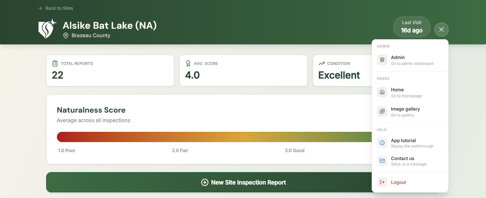 


### 8.3 Header with Action Button (Account Management)

When a page needs a primary action button in the header, it is grouped together with the `AdminNavBar` in a single right-side container:

```tsx
<div className="flex items-center gap-3">
  <button onClick={...}
          className="bg-white text-[#356B43] px-6 py-3 rounded-xl font-semibold
                      hover:shadow-lg transition-all flex items-center gap-2">
    <UserPlus className="w-5 h-5" />
    Add User
  </button>
  <div className="[&>nav]:bg-none [&>nav]:bg-transparent ...">
    <AdminNavBar />
  </div>
</div>
```
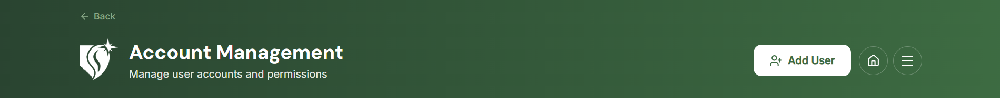 


### 8.4 SAPAA Logo

| Property | Current Usage |
|---|---|
| Source | `/images/sapaa-icon-white.png` |
| Size/CSS | Varies by page (e.g., `140x140` with large header treatment, and compact `24x24` icon in report pages) |
| Alt text | Varies by page (`"SAPAA"` on many headers, `"Logo"` on current new/edit report pages) |
| Priority | Used where appropriate for above-the-fold logo rendering |

### 8.5 Back Button

Back navigation exists on detail/report pages but currently has two variants:
- Text + icon (`"Back to Sites"`) on Site Detail.
- Icon-only circular button (`ArrowLeft`) on New/Edit Report pages.

| Property | Current Usage |
|---|---|
| Text | Site Detail uses `"Back to Sites"`; New/Edit Report currently use icon-only back buttons |
| Icon | `ArrowLeft` used in all back-navigation variants |
| Spacing/Placement | Page-specific (either above header row as text link, or inline in title row as icon button) |

---

## 9. Stats Cards

Two stats card styles exist in the application. The Large Icon style is the preferred convention for all admin pages.

 

### 9.1 Large Icon Style (Preferred - Admin Pages)

Used on the Admin Dashboard, Account Management, and any new admin pages. Features a 48x48 gradient icon container beside the label and value:

```tsx
<div className="bg-white rounded-2xl p-6 border-2 border-[#E4EBE4] shadow-sm">
  <div className="flex items-center gap-4">
    <div className="w-12 h-12 bg-gradient-to-br from-[#356B43] to-[#254431]
                    rounded-xl flex items-center justify-center">
      <Icon className="w-6 h-6 text-white" />
    </div>
    <div>
      <div className="text-sm font-semibold text-[#7A8075] uppercase tracking-wide">
        Label
      </div>
      <div className="text-3xl font-bold text-[#254431]">{value}</div>
    </div>
  </div>
</div>
```

### 9.2 Compact Style (Legacy - Site List Header)

Used only in the HomeClient stats strip. Kept for backward compatibility but should not be used on new pages.

```tsx
<div className="bg-white rounded-xl p-4 border-2 border-[#E4EBE4] shadow-sm">
  <div className="flex items-center gap-2 mb-2">
    <Icon className="w-5 h-5 text-[#356B43]" />
    <div className="text-sm text-[#7A8075] font-medium uppercase tracking-wide">Label</div>
  </div>
  <div className="text-3xl font-bold text-[#254431]">{value}</div>
</div>
```

### 9.3 Stats Grid Layout

| Property | Value |
|---|---|
| Admin Grid | `grid grid-cols-1 md:grid-cols-3 gap-6` |
| Site List Grid | `grid grid-cols-2 md:grid-cols-5 gap-4` (compact strip) |
| Card radius | `rounded-2xl` (large style) / `rounded-xl` (compact) |
| Card padding | `p-4 sm:p-5` (responsive) / `p-6` (large) / `p-4` (compact) |
| Border | `border-2 border-[#E4EBE4]` |

### 9.4 Coloured Card Variants

When a card needs semantic colour (e.g., role summaries, status counts), override the background and border:

| Variant | Classes |
|---|---|
| Green | `bg-[#D1FAE5] border-2 border-[#065F46]/20` |
| Red | `bg-[#FEE2E2] border-2 border-[#B91C1C]/20` |
| Amber | `bg-[#FEF3C7] border-2 border-[#92400E]/20` |

### 9.5 Clickable / Linked Card

When a card is a navigation link (e.g., Image Gallery on the dashboard), wrap it in a Next.js `Link` with block display and hover elevation:

```tsx
<Link href="/admin/gallery" className="block">
  <div className="bg-white rounded-2xl p-6 border-2 border-[#E4EBE4] shadow-sm
                  hover:border-[#86A98A] hover:shadow-lg transition-all h-full">
    ...
  </div>
</Link>
```

---

## 10. Status Badges

Inspection status is communicated through inline coloured badges. Badge style follows the pattern: `rounded-full px-3 py-1 text-xs font-semibold`.

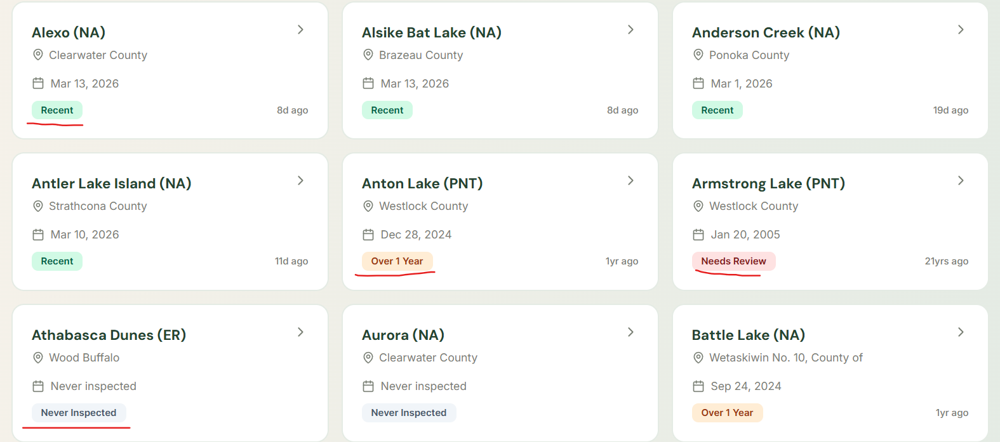 

### 10.1 Inspection Status Badges

| Label | Text colour | Background | Condition |
|---|---|---|---|
| Never Inspected | `#475569` | `#F1F5F9` | No inspection on record |
| Recently Inspected | `#065F46` | `#D1FAE5` | Within 180 days |
| Inspected This Year | `#92400E` | `#FEF3C7` | 181–365 days |
| Over 1 Year Ago | `#9A3412` | `#FFEDD5` | 366–730 days |
| Needs Review | `#7F1D1D` | `#FEE2E2` | More than 730 days |

### 10.2 Question Type Badges (Form Editor)

| Badge | Condition |
|---|---|
| Required | Shown on question cards when `is_required = true` |
| Hidden | Shown on question card when `is_active = false` - `bg-gray-200 text-gray-600` |
| LIVE DRAFT | Shown on preview panel header when Add Question form is open - `animate-pulse` |

### 10.3 General Badge Pattern

```tsx
{/* Standard badge */}
<span className="text-xs font-semibold px-3 py-1 rounded-full">
  {label}
</span>

{/* Micro badge (10px) for cards */}
<span className="text-[10px] px-1.5 py-0.5 rounded-full font-bold uppercase tracking-tight">
  {label}
</span>
```

---

## 11. Buttons

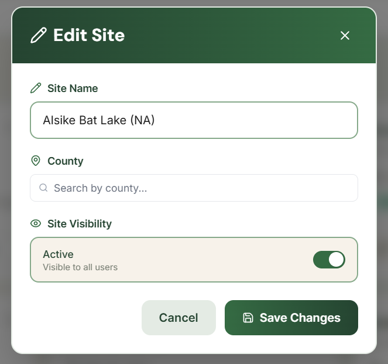 

### 11.1 Primary Button

Used for the main action on a page or section. Always uses the forest gradient.

```tsx
<button className="flex items-center gap-2 px-4 py-2.5
                   bg-gradient-to-r from-[#356B43] to-[#254431]
                   text-white text-sm font-semibold rounded-xl
                   hover:shadow-lg transition-all disabled:opacity-50">
  <Icon className="w-4 h-4" />
  Label
</button>
```

### 11.2 Secondary / Ghost Button

Used alongside a primary button for cancel or alternate actions.

```tsx
<button className="px-4 py-2.5 border-2 border-[#E4EBE4] text-[#7A8075]
                   text-sm font-semibold rounded-xl hover:bg-[#E4EBE4]
                   transition-all">
  Cancel
</button>
```

### 11.3 Header Primary Button (White on Green)

Used when a primary action lives inside the green header. Background is white with green text to contrast against the dark header.

```tsx
<button className="bg-white text-[#356B43] px-6 py-3 rounded-xl font-semibold
                   hover:shadow-lg transition-all flex items-center gap-2">
  <Icon className="w-5 h-5" />
  Add User
</button>
```

### 11.4 Icon-Only Buttons

Small icon buttons used inside cards and list rows:

| Variant | Classes |
|---|---|
| Edit | `w-7 h-7 rounded-lg text-[#356B43] hover:bg-[#EEF5EF]` |
| Toggle | `p-1.5 rounded-md` - active: `text-[#7A8075] hover:bg-[#F7F2EA]` / inactive: `text-amber-600 bg-amber-50 hover:bg-amber-100` |
| Delete | `w-8 h-8 rounded-lg text-[#B91C1C] hover:bg-[#FEE2E2]` |
| Close | `ml-auto` on alert banners |

### 11.5 Text Link Button

Used for secondary in-body actions like "+ Add a question":

```tsx
<button className="text-sm text-[#356B43] font-semibold hover:underline
                   flex items-center gap-1">
  <Plus className="w-3.5 h-3.5" />
  Add a question
</button>
```

### 11.6 Section Add Button (Sidebar)

Small square icon button in a sidebar header:

```tsx
<button className="w-7 h-7 bg-[#E4EBE4] hover:bg-[#356B43] hover:text-white
                   text-[#356B43] rounded-lg flex items-center justify-center
                   transition-all">
  <Plus className="w-4 h-4" />
</button>
```

---

## 12. Form Inputs

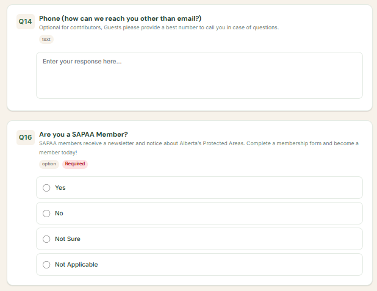 

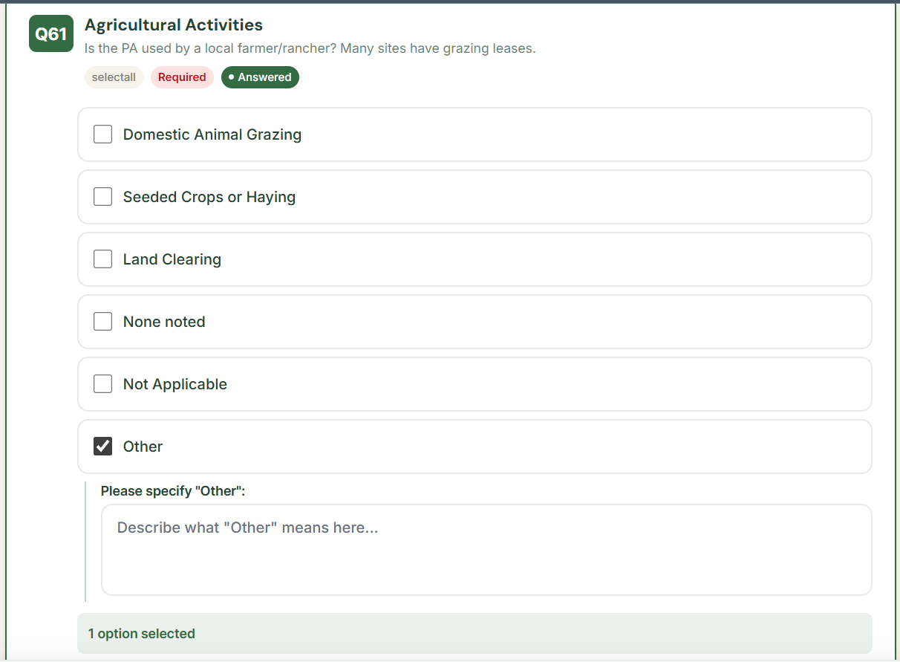 

### 12.1 Standard Text Input

```tsx
<input type="text"
  className="w-full px-3 py-2.5 border-2 border-[#E4EBE4] rounded-xl text-sm
             focus:outline-none focus:border-[#356B43] transition-colors
             placeholder:text-[#7A8075]" />
```

### 12.2 Textarea

```tsx
<textarea rows={2}
  className="w-full px-3 py-2.5 border-2 border-[#E4EBE4] rounded-xl text-sm
             focus:outline-none focus:border-[#356B43] resize-none transition-colors
             placeholder:text-[#7A8075]" />
```

### 12.3 Checkbox

```tsx
<input type="checkbox"
  className="w-4 h-4 text-[#356B43] rounded focus:ring-[#356B43]" />
```

### 12.4 Label Pattern

All input labels follow the same uppercase `tracking-wide` pattern and sit above the input with `mt-1` on the control:

```tsx
<label className="text-xs font-semibold text-[#7A8075] uppercase tracking-wide">
  Field Name
</label>
<input className="... mt-1" />
```

### 12.5 Input Container (Inline Form Card)

When a mini-form appears inline (Add Section form, Edit Question form), it is wrapped in:

```tsx
<div className="bg-white border-2 border-[#356B43] rounded-xl p-5 shadow-md">
  ...
</div>
```

The green border signals that this area is in an active edit state. The form actions bar at the bottom is separated by a top border:

```tsx
<div className="flex gap-2 mt-5 pt-4 border-t-2 border-[#E4EBE4]">
  {/* primary + secondary buttons */}
</div>
```

---

## 13. Cards and Panels

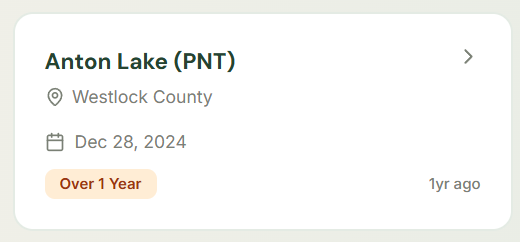 

### 13.1 Standard White Card

The default content container used throughout the application:

```tsx
<div className="bg-white rounded-2xl border-2 border-[#E4EBE4] shadow-sm p-6">
  ...
</div>
```

| Property | Value |
|---|---|
| Border radius | `rounded-2xl` (preferred) or `rounded-xl` (compact contexts) |
| Border | `border-2 border-[#E4EBE4]` - always 2px, always sage green |
| Shadow | `shadow-sm` at rest, `shadow-lg` on hover (for interactive cards) |
| Padding | `p-6` (standard) / `p-4` (compact sidebar cards) / `p-5` (form cards) |

### 13.2 Sidebar Panel

```tsx
<div className="bg-white rounded-2xl border-2 border-[#E4EBE4] p-4">
  <div className="flex items-center justify-between mb-4">
    <h3 className="text-sm font-bold text-[#254431] uppercase tracking-wide">
      Sections
    </h3>
    {/* action button */}
  </div>
  {/* list */}
</div>
```

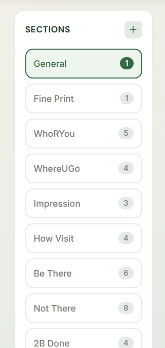 


### 13.3 Sticky Preview Panel

The right-side preview panel in the Form Editor is sticky so it stays visible while scrolling:

```tsx
<div className="bg-[#F7F2EA] rounded-2xl border-2 border-[#E4EBE4] p-5 sticky top-6">
  ...
</div>
```

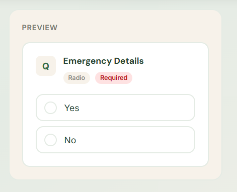 


### 13.4 Active / Selected Card State

Cards that support selection toggle their border when selected:

```tsx
{/* Default */}
border-[#E4EBE4] hover:border-[#86A98A]

{/* Selected */}
border-[#356B43] shadow-sm
```

### 13.5 Empty State Card

```tsx
<div className="text-center py-16 bg-white rounded-2xl
                border-2 border-dashed border-[#E4EBE4]">
  <Icon className="w-12 h-12 text-[#E4EBE4] mx-auto mb-3" />
  <p className="text-[#7A8075] font-medium">No items yet.</p>
  <button className="mt-4 text-sm text-[#356B43] font-semibold hover:underline">
    + Add one
  </button>
</div>
```
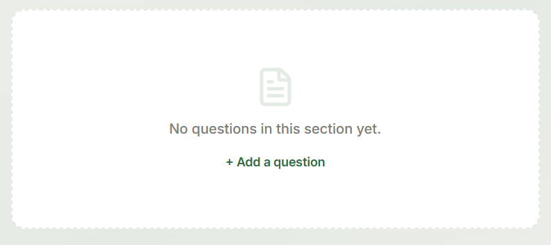 

---

## 14. Alerts and Feedback

### 14.1 Error Alert

```tsx
<div className="bg-[#FEE2E2] border-2 border-[#FECACA] text-[#B91C1C]
               px-4 py-3 rounded-xl flex items-center gap-3">
  <AlertCircle className="w-5 h-5 flex-shrink-0" />
  <span className="text-sm font-medium">{error}</span>
  <button onClick={() => setError(null)} className="ml-auto">
    <X className="w-4 h-4" />
  </button>
</div>
```

### 14.2 Success Alert

```tsx
<div className="bg-[#DCFCE7] border-2 border-[#BBF7D0] text-[#166534]
               px-4 py-3 rounded-xl flex items-center gap-3">
  <span className="text-sm font-medium">{successMessage}</span>
</div>
```

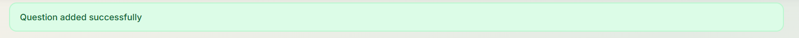 


### 14.3 Alert Behaviour

- Alerts appear immediately below the header, inside the `max-w-7xl mx-auto px-6 pt-4` container.
- Success messages auto-dismiss after 3 seconds using `setTimeout(() => setSuccessMessage(null), 3000)`.
- Error alerts include a manual dismiss button (X icon, `ml-auto`).
- Both use `border-2` (not `border-1`) for visual weight consistency with cards.

---

## 15. Loading States

### 15.1 Full-Page Loader

When a page is loading its initial data, render a centred spinner on the page background:

```tsx
<ProtectedRoute requireAdmin>
  <div className="min-h-screen bg-gradient-to-br from-[#F7F2EA] via-[#E4EBE4]
                  to-[#F7F2EA] flex flex-col items-center justify-center gap-4">
    <Loader2 className="w-12 h-12 text-[#356B43] animate-spin" />
    <p className="text-[#7A8075] font-medium">Loading...</p>
  </div>
</ProtectedRoute>
```

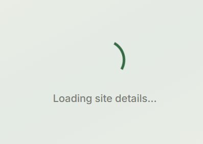 

### 15.2 Button Loading State

When a save/submit operation is in progress, replace the button icon with a spinning `Loader2`:

```tsx
<button disabled={saving} ...>
  {saving ? <Loader2 className="w-4 h-4 animate-spin" /> : <Save className="w-4 h-4" />}
  {saving ? 'Saving...' : 'Save Changes'}
</button>
```
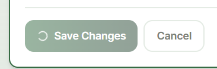 

### 15.3 Leaflet / Map SSR Guard

The Leaflet map component cannot render server-side. Use a mounted state flag to prevent SSR errors:

```tsx
const [mounted, setMounted] = useState(false);
useEffect(() => { setMounted(true); }, []);

{mounted
  ? <Map points={points} />
  : <div className="h-full flex items-center justify-center bg-[#F7F2EA]">
      <Loader2 className="w-8 h-8 text-[#356B43] animate-spin" />
    </div>
}
```

---

## 16. Drag and Drop

The Form Editor implements drag-and-drop question reordering using `@dnd-kit`. These conventions must be followed for correct behaviour.

### 16.1 Setup

```tsx
const sensors = useSensors(
  useSensor(PointerSensor, { activationConstraint: { distance: 8 } })
);

<DndContext
  sensors={sensors}
  collisionDetection={rectIntersection}
  onDragEnd={handleDragEnd}
>
  <SortableContext
    items={currentQuestions.map(q => q.id)}
    strategy={verticalListSortingStrategy}
  >
    ...
  </SortableContext>
</DndContext>
```

### 16.2 Drag Handle

Each sortable item exposes only a grip handle (not the whole card) as the drag trigger. The handle uses `touch-none` and stops click propagation to avoid triggering card selection:

```tsx
<button {...attributes} {...listeners}
  className="touch-none flex-shrink-0 cursor-grab active:cursor-grabbing
             p-0.5 rounded hover:bg-[#E4EBE4] transition-colors"
  onClick={e => e.stopPropagation()}>
  <GripVertical className="w-4 h-4 text-[#7A8075]" />
</button>
```
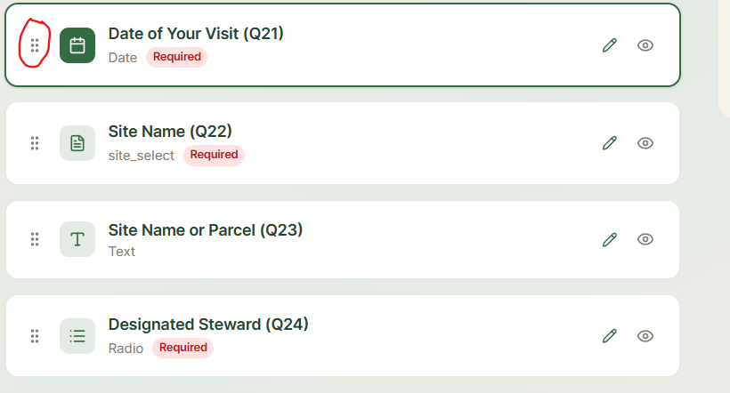 


### 16.3 Drag Visual Feedback

| State | Classes |
|---|---|
| Dragging card | `opacity-50`, `shadow-lg`, `scale-[1.02]` |
| Drop target section | `bg-[#DCFCE7] border-[#22C55E] scale-[1.03] shadow-md` |
| Section count pill | `bg-[#22C55E] text-white` when over |

---

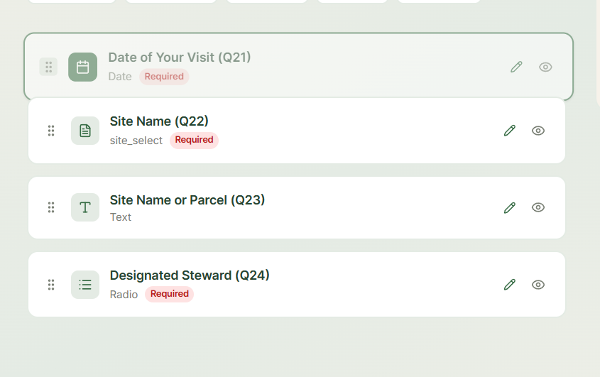 

## 17. AdminNavBar

The `AdminNavBar` component is shared across all admin pages. Its internal structure must not be modified since UI tests depend on specific elements being present.

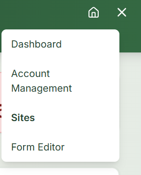 

### 17.1 Test-Critical Elements

- A home link to `/sites` (currently icon-only `Home`, no visible `"Home"` text label).
- A button with `title="admin dropdown menu"` (hamburger/menu trigger).
- Dropdown item labels (`Dashboard`, `Account Management`, `Sites`, `Form Editor`).

### 17.2 Current Spacing

Current `AdminNavBar` buttons use `p-2` and do not include `ml-2` on the hamburger button.

### 17.3 Inline Rendering in Headers

When rendered inside a page header, `AdminNavBar`'s background is overridden with the child selector approach described in Section 8.2.

---

## 18. Database and Data Layer

### 18.1 Active Tables (W26_ prefix)

| Table | Purpose |
|---|---|
| `W26_form_responses` | Inspection form submissions - primary data table |
| `W26_answers` | Individual question answers (`obs_value`, `question_id`, `response_id`) |
| `W26_questions` | Form question definitions (`form_question`, `question key`, `question_type`) |
| `W26_question_options` | Answer options for radio/checkbox questions |
| `W26_sites-pa` | Protected area site records (`namesite`, `is_active`, `id`) |
| `W26_attachments` | Photos attached to form responses |
| `W26_form_sections` | Form section metadata |
| `W26_ab_counties` | County/region lookup |

### 18.2 Postgres RPC Functions

Aggregate queries are implemented as Supabase RPC functions to avoid complex client-side joins:

| Function | Description |
|---|---|
| `get_naturalness_distribution()` | Returns normalised naturalness score buckets with counts from `W26_answers` |
| `get_top_sites_distribution()` | Returns top 5 active sites by inspection count from `W26_form_responses` and `W26_sites-pa` |

### 18.3 Naturalness Score Normalisation

Raw `obs_value` data for naturalness is inconsistently stored (e.g., "4 - Great", "4 = Great", "Great"). The RPC uses `ILIKE` pattern matching with a `CASE` statement to normalise these into five canonical buckets: Great, Good, Passable, Terrible, and Cannot Answer.

---

## 19. Testing Conventions

### 19.1 Test IDs

Components commonly use `data-testid` attributes for reliable test selection. Prefer test IDs and stable semantic selectors.  
Current test suites also include some CSS/text selectors where no stable test ID exists.

| Test ID | Element |
|---|---|
| `section-button-{id}` | Section nav buttons in Form Editor sidebar |
| `section-count-{id}` | Question count pill on section buttons |
| `question-card-{id}` | Question row cards in Form Editor |
| `edit-question-button` | Pencil icon button on question cards |
| `edit-question-title` | Title input in Edit Question form |
| `edit-question-subtext` | Subtext textarea in Edit Question form |
| `save-question-button` | Save Changes button in Edit Question form |
| `cancel-button` | Cancel button in Edit Question form |
| `add-question-title` | Title input in Add Question form |
| `add-question-subtext` | Subtext textarea in Add Question form |
| `add-question-key` | Question key input in Add Question form |
| `question-type-{label}` | Type selector buttons (e.g., `question-type-Radio`) |
| `save-new-question` | Add Question submit button |
| `{question} Hide Button` | Toggle button when question is active |
| `{question} Show Button` | Toggle button when question is hidden |

### 19.2 Test-Critical UI Text

The following strings/attributes are currently asserted by parts of the UI test suite:

- Site detail back button: `"Back to Sites"`
- Admin menu trigger title: `"admin dropdown menu"`
- Logo alt text varies by page (`"SAPAA"` and `"Logo"` both exist in current implementation)

### 19.3 Mocking Strategy

AdminDashboard tests require these mocks:

- `@/utils/supabase/queries` - mock the query functions directly
- `react-chartjs-2` - mock `Pie` as a simple `div` with `data-testid="pie-chart"`
- `chart.js` - mock `Chart.register`, `ArcElement`, `Tooltip`, `Legend`
- `@/utils/supabase/server` - mock to prevent `'use server'` import errors
- `global.fetch` - default mock in `beforeEach` returning `{ ok: true, json: async () => ({ items: [] }) }`

Re-apply all query mocks in `beforeEach` after `jest.clearAllMocks()`. Import the Dashboard component only after all mocks are registered.

---

## 20. Responsive Design

The application uses a mobile-first responsive design approach. All responsive behaviour is implemented through Tailwind CSS responsive utility classes — no custom CSS media queries are used (except for dark mode preference detection in `globals.css`).

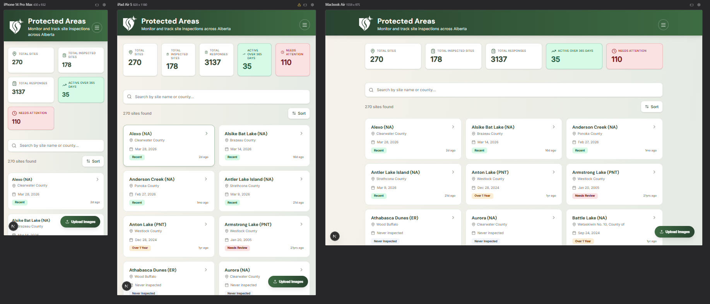

### 20.1 Breakpoints

The application follows Tailwind's standard breakpoint system:

| Breakpoint | Min Width | Usage |
|---|---|---|
| (base) | 0px | Mobile phones — single-column layouts, stacked elements |
| `sm:` | 640px | Large phones / small tablets — two-column grids, inline buttons |
| `md:` | 768px | Tablets — expanded stat grids, increased padding |
| `lg:` | 1024px | Desktop — three-column grids, side-by-side modals, flex-row layouts |
| `xl:` | 1280px | Large desktop — four-column image galleries, wider padding |
| `2xl:` | 1536px | Extra-large — maximum content widths |

### 20.2 Mobile-First Approach

Base styles always target the smallest screen. Larger breakpoints override progressively:

```tsx
{/* Text: small on mobile, larger on tablet+ */}
className="text-2xl sm:text-3xl font-bold"

{/* Padding: tighter on mobile, more spacious on tablet+ */}
className="px-4 sm:px-6 py-4 sm:py-6"

{/* Layout: stacked on mobile, side-by-side on tablet+ */}
className="flex flex-col sm:flex-row"
```

### 20.3 Responsive Grid Layouts

The application uses several responsive grid patterns depending on content type:

| Pattern | Classes | Used For |
|---|---|---|
| Site Cards | `grid grid-cols-1 sm:grid-cols-2 lg:grid-cols-3 gap-4` | Site listing, admin sites |
| Image Gallery | `grid grid-cols-1 sm:grid-cols-2 lg:grid-cols-3 xl:grid-cols-4 gap-4 sm:gap-6` | Gallery pages |
| Stats Strip | `grid grid-cols-2 md:grid-cols-5 gap-4` | Site list dashboard stats |
| Admin Stats | `grid grid-cols-1 md:grid-cols-3 gap-6` | Admin dashboard stat cards |

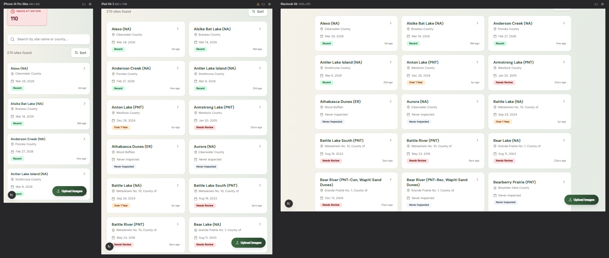

### 20.4 Navigation — Hamburger Menu

Navigation uses an animated hamburger menu accessible on all screen sizes (no separate desktop navigation bar). The `HeaderDropdown` and `AdminNavBar` components implement this:

- **Trigger:** 44x44px button (`w-11 h-11`) with three animated lines
- **Animation:** Lines transform to an X icon when open via `translate-y` and `rotate` transforms
- **Dropdown:** Fixed-width menu (`w-60`) positioned absolutely, with backdrop overlay
- **Backdrop:** `fixed inset-0 z-40` semi-transparent overlay for mobile touch dismissal

```tsx
{/* Hamburger button — always visible, no breakpoint hiding */}
<button onClick={() => setMenuOpen(!menuOpen)}
        className="w-11 h-11 flex flex-col items-center justify-center gap-[5px] rounded-xl
                   bg-white/10 hover:bg-white/20 transition-all">
  <span className={`block h-[2px] w-5 bg-white transition-all duration-300
        ${menuOpen ? 'translate-y-[7px] rotate-45' : ''}`} />
  <span className={`block h-[2px] w-5 bg-white transition-all duration-300
        ${menuOpen ? 'opacity-0' : ''}`} />
  <span className={`block h-[2px] w-5 bg-white transition-all duration-300
        ${menuOpen ? '-translate-y-[7px] -rotate-45' : ''}`} />
</button>
```

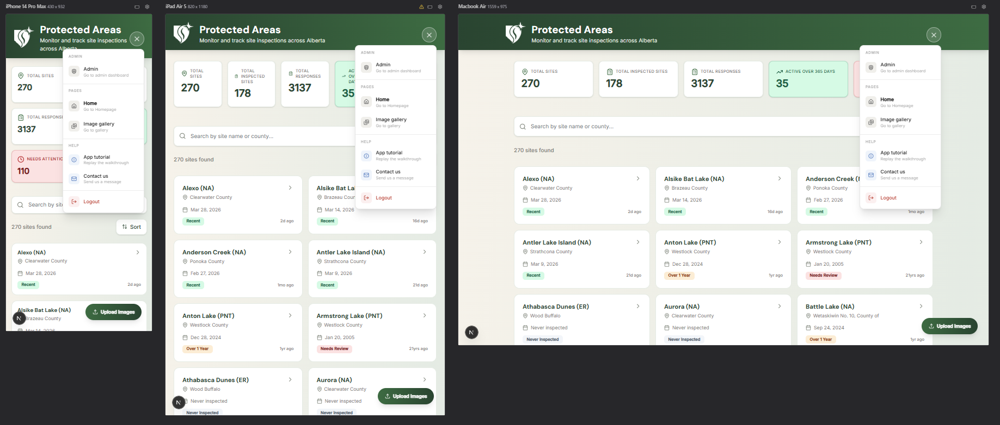

### 20.5 Authentication Pages — Split Layout

Login and signup pages use a two-column split layout on desktop that collapses to single-column on mobile:

```tsx
<div className="grid lg:grid-cols-2 min-h-screen">
  {/* Left panel: branding — hidden on mobile, visible on lg+ */}
  <div className="hidden lg:flex flex-col justify-between relative overflow-hidden
                  bg-gradient-to-br from-[#356B43] via-[#254431] to-[#356B43]
                  text-[#F7F2EA] px-12 xl:px-16 py-12">
    ...
  </div>

  {/* Right panel: form — always visible */}
  <div className="flex items-center justify-center px-6 sm:px-8 lg:px-12 py-12">
    {/* Mobile-only logo (hidden on lg+) */}
    <div className="lg:hidden flex items-center gap-3 mb-8">
      ...
    </div>
    ...
  </div>
</div>
```

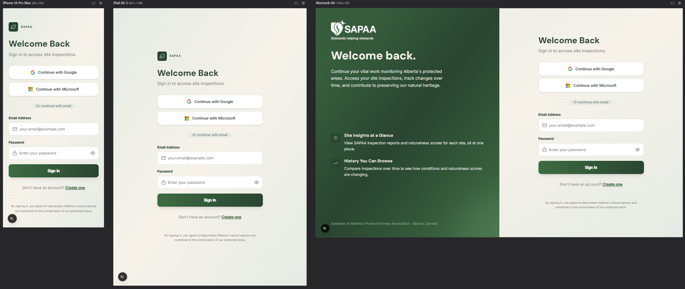

### 20.6 Responsive Typography

Text sizes scale up at breakpoints to maintain readability:

| Element | Mobile | Tablet (`sm:`) | Desktop (`lg:`) |
|---|---|---|---|
| Page title (header) | `text-2xl` | `text-3xl` | `text-3xl` |
| Section heading | `text-xl` | `text-2xl` | `text-2xl` |
| Stat numbers | `text-2xl` | `text-3xl` | `text-3xl` |
| Body text | `text-sm` | `text-base` | `text-base` |
| Labels/captions | `text-xs` | `text-sm` | `text-sm` |
| Icon sizes | `w-4 h-4` | `w-5 h-5` | `w-5 h-5` |

### 20.7 Responsive Spacing

Padding and gap values increase at breakpoints:

| Element | Mobile | Tablet (`sm:`) | Desktop (`md:`/`lg:`) |
|---|---|---|---|
| Page padding | `px-4 py-4` | `px-6 py-6` | `px-6 py-8` |
| Card padding | `p-4` | `p-5` or `p-6` | `p-6` |
| Grid gap | `gap-4` | `gap-6` | `gap-6` |
| Button padding | `px-4 py-2.5` | `px-5 py-2.5` | `px-5 py-2.5` |

### 20.8 Responsive Modals

Image preview modals adapt from stacked to side-by-side layout:

```tsx
{/* Modal overlay — responsive padding */}
<div className="fixed inset-0 z-50 bg-black/80 backdrop-blur-sm
                flex items-center justify-center p-3 sm:p-4 md:p-8">
  {/* Modal content — stacked on mobile, two-column on desktop */}
  <div className="grid grid-cols-1 lg:grid-cols-[minmax(0,1fr)_360px] flex-1 min-h-0">
    {/* Image viewer: responsive max-height */}
    <div className="max-h-[40vh] sm:max-h-[50vh] lg:max-h-[85vh]">
      
    </div>
    {/* Details sidebar: stacks below image on mobile, fixed 360px on lg+ */}
    <div className="min-h-[220px] sm:min-h-[300px] lg:min-h-0 overflow-y-auto">
      ...
    </div>
  </div>
</div>
```

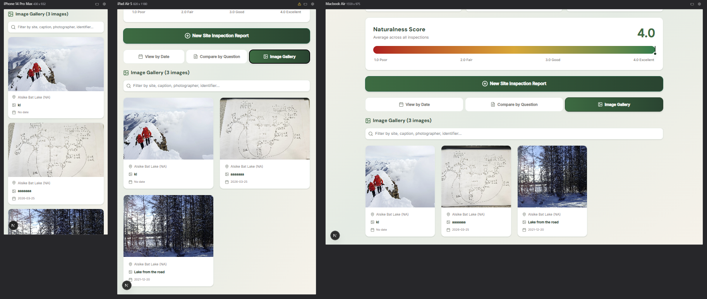

### 20.9 Sticky Report Footer

The new-report and edit-report pages use a responsive sticky footer with section navigation, progress bar, and submit button:

```tsx
<footer className="sticky bottom-0 bg-white border-t-2 border-[#E4EBE4]
                   p-4 md:px-8 shadow-[0_-4px_20px_rgba(0,0,0,0.05)] z-50">
  <div className="max-w-7xl mx-auto flex flex-col gap-4 lg:flex-row lg:items-end">
    {/* Section nav buttons: stacked on mobile, row on sm+ */}
    <div className="flex w-full flex-col gap-3 sm:flex-row lg:w-auto">
      <button className="w-full sm:w-auto sm:min-w-[10rem] ...">← Previous</button>
      <button className="w-full sm:w-auto sm:min-w-[10rem] ...">Next →</button>
    </div>
    {/* Progress bar: full width on mobile, fills remaining space on lg+ */}
    <div className="w-full min-w-0 lg:flex-1">...</div>
    {/* Submit: full width on mobile, auto width on sm+ */}
    <button className="w-full sm:w-auto sm:min-w-[13rem] lg:flex-shrink-0 ...">
      Review & Submit
    </button>
  </div>
</footer>
```

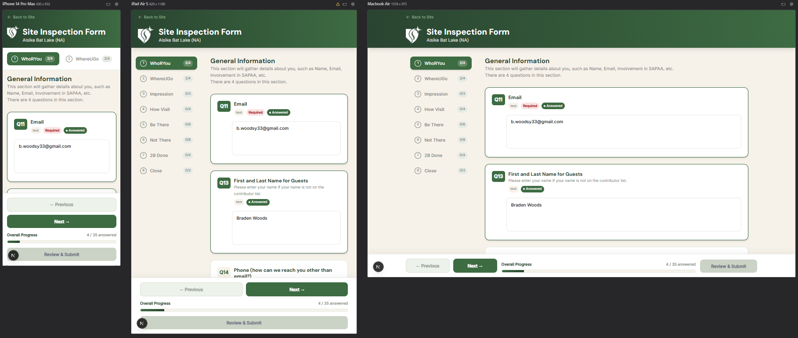

### 20.10 Responsive Visibility

Use Tailwind's `hidden` and display utilities to show/hide elements at breakpoints:

| Pattern | Classes | Example |
|---|---|---|
| Mobile-only | `lg:hidden` | Compact logo on login page |
| Desktop-only | `hidden lg:flex` | Left branding panel on auth pages |
| Desktop-only (block) | `hidden lg:block` | Live preview panel in Form Editor |

**Important:** Do not use `hidden md:flex` or similar on text that tests must find (see Section 19.2).

### 20.11 Responsive Buttons

Buttons adapt from full-width stacked layout on mobile to inline auto-width on larger screens:

```tsx
{/* Full-width on mobile, auto-width side-by-side on sm+ */}
<div className="flex flex-col sm:flex-row gap-3">
  <button className="w-full sm:w-auto sm:min-w-[10rem] ...">Cancel</button>
  <button className="w-full sm:w-auto sm:min-w-[10rem] ...">Save</button>
</div>
```

### 20.12 Responsive Images

Gallery images and thumbnails use responsive heights:

| Context | Mobile | Tablet (`sm:`) | Desktop (`lg:`) |
|---|---|---|---|
| Gallery card | `h-56` | `h-64` | `h-64` |
| Modal image | `max-h-[40vh]` | `max-h-[50vh]` | `max-h-[85vh]` |
| Header logo | `h-12` | `h-16` | `h-16` |

All images use `object-contain` for proper scaling without distortion.

### 20.13 Files with Responsive Patterns

The following files contain significant responsive design implementation:

| File | Responsive Features |
|---|---|
| `app/sites/page.tsx` | Stats grid (2→5 cols), card grid (1→2→3 cols), responsive header |
| `app/gallery/page.tsx` | Image grid (1→2→3→4 cols), responsive modal |
| `app/login/page.tsx` | Split layout (1→2 cols), hidden/visible panels |
| `app/signup/page.tsx` | Same split layout pattern as login |
| `app/detail/[namesite]/page.tsx` | Responsive site detail, expandable sections |
| `app/detail/[namesite]/new-report/Footer.tsx` | Sticky footer with responsive button layout |
| `app/admin/dashboard/page.tsx` | Responsive chart layout, stats grid |
| `app/admin/sites/page.tsx` | Responsive site management grid |
| `app/admin/gallery/page.tsx` | Responsive gallery grid |
| `app/admin/form-editor/page.tsx` | Three-column layout, preview panel hidden on mobile |
| `app/admin/account-management/page.tsx` | Responsive account cards/table |
| `components/HeaderDropdown.tsx` | Hamburger menu navigation |
| `app/admin/AdminNavBar.tsx` | Admin hamburger menu navigation |
| `components/UploadImages.tsx` | Responsive upload modal |
| `app/terms/TermsContent.tsx` | Responsive text layout |

---

## Appendix A - Quick Reference

### A.1 Full Colour Tokens

| Token | Value |
|---|---|
| `--forest-dark` | `#254431` |
| `--forest-mid` | `#356B43` |
| `--forest-light` | `#86A98A` |
| `--bg-warm` | `#F7F2EA` |
| `--bg-cool` | `#E4EBE4` |
| `--text-primary` | `#1E2520` |
| `--text-muted` | `#7A8075` |
| `--status-red` | `#B91C1C` / `#FEE2E2` |
| `--status-dark-red` | `#7F1D1D` / `#FEE2E2` |
| `--status-green` | `#065F46` / `#D1FAE5` |
| `--status-amber` | `#92400E` / `#FEF3C7` |
| `--status-orange` | `#9A3412` / `#FFEDD5` |
| `--status-slate` | `#475569` / `#F1F5F9` |

### A.2 Checklist for New Pages

- Wrap the return in a `min-h-screen` container (gradient pattern is preferred for most pages).
- Build the header using a green-banner pattern with page-appropriate variant (standard site-detail header, admin header with `AdminNavBar`, or compact report header).
- Close the header `div` before opening the main content `div`.
- Use the large icon stats card style (Section 9.1) for all new admin stats.
- Prefer `W26_` tables for new work; do not add new dependencies on legacy `sites_*` tables.
- Add `data-testid` to all interactive elements.
- Do not use `hidden md:flex` on text that tests must find.
- Wrap Leaflet maps in a mounted guard (Section 15.3).
- **Use responsive padding:** `px-4 sm:px-6` for horizontal padding, `py-4 sm:py-6` for vertical.
- **Use responsive grids:** Start with `grid-cols-1` and scale up with `sm:grid-cols-2 lg:grid-cols-3`.
- **Use responsive text sizes:** Base at mobile size and scale with `sm:` prefix (e.g., `text-2xl sm:text-3xl`).
- **Stack on mobile, row on desktop:** Use `flex flex-col sm:flex-row` for groups of buttons or inline elements.
- **Full-width buttons on mobile:** Use `w-full sm:w-auto` for action buttons.
- **Test at all breakpoints:** Verify layout at 375px (mobile), 768px (tablet), and 1280px (desktop).

---

*End of Document*

**Document Version:** 3.0
**Last Updated:** March 2026
**Prepared for:** Stewards of Alberta's Protected Areas Association
